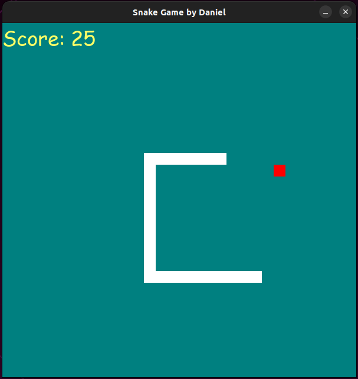

# Simple Snake Game :snake:
Simple Snake Game with pgame python3 package.


<p align="center">
  
</p>

## Introduction :door:
This game is simply developed on `linux os`. I didn't deploy it with any deployment method. But it can accessed from this [GitHub](git@github.com:getdaniel/Simple-Snake-Game.git). <br>
You can see [My blogs](https://www.linkedin.com/pulse/simple-snake-game-pygame-daniel-getaneh) post about this game on my [Linkedin Account](https://www.linkedin.com/in/daniel-getaneh-50b459175/). The blog describes all about the project. I made this project simply, because the givent time to complete the project is less than a month and other reasons.

## Installation :arrow_down:
```
$ git clone https://github.com/getdaniel/Simple-Snake-Game.git
$ cd Simple-Snake-Game
$ ./snake.py
```
Enjoy with this simple snake game.

## Usage :horse_racing:
### Step :one::
Clone like 
```
git clone https://github.com/getdaniel/Simple-Snake-Game.git
```
### Step :two::
Go to the cloned folder with the below command
```
cd Simple-Snake-Game <br>
./snake.py
```
### Step :three::
Start to play the game with the following instruction <br>
Press :arrow_up: to go UP <br>
Press :arrow_down: to go DOWN <br>
Press :arrow_right: to go RIGHT <br>
Press :arrow_left: to go LEFT <br>
Press `p` to PAUSE the Game <br>
Press `c` to CONTINUE the Game <br>

## About the Developer :man_technologist: :ethiopia:
* **Daniel Shibabaw** - <[getdaniel](https://github.com/getdaniel/)>

## License :lock:
This project is licensed under the MIT License :arrow_right: [LICENSE](https://github.com/getdaniel/Simple-Snake-Game/blob/main/LICENSE)
